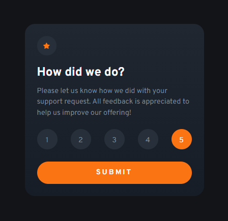

# Frontend Mentor - Interactive rating component solution

This is a solution to the [Interactive rating component challenge on Frontend Mentor](https://www.frontendmentor.io/challenges/interactive-rating-component-koxpeBUmI). Frontend Mentor challenges help you improve your coding skills by building realistic projects.

Design preview:

## Table of contents

- [Overview](#overview)
  - [The challenge](#the-challenge)
  - [Screenshot](#screenshot)
  - [Links](#links)
- [My process](#my-process)
  - [Built with](#built-with)
  - [What I learned](#what-i-learned)
  - [Continued development](#continued-development)
- [Author](#author)

## Overview

### The challenge

Users should be able to:

- View the optimal layout for the app depending on their device's screen size
- See hover states for all interactive elements on the page
- Select and submit a number rating
- See the "Thank you" card state after submitting a rating

### Screenshot

This is a screenshot of my solution to the challenge!


### Links

- Live Site URL: [Github Pages](https://albana-meloni.github.io/rating-component/)

## My process

### Built with

- Semantic HTML5 markup
- SASS advantages (map, nesting)
- Flexbox
- Mobile-first workflow

### What I learned

I'm newbie at JS, still learning, so this was a real challenge for me, not just for giving the project a correct structure but the javascript code running well. I feel very proud of what I achieved by doing this! It was one of my first time using a querySelectorAll and then use methods of arrays (like forEach).

```js
let ratings = document.querySelectorAll(".rate-number");
ratings.forEach(rate => rate.addEventListener("click", ()=> { ... }));
```

While writing it I thought it wouldn't work!!

### Continued development

Obviusly I do have to continue focusing on the correct way of writing JS. Because I'm used to write a lot of code when maybe it can be done just by a few lines. Gotta still working on logic!

## Author

- [Frontend Mentor](https://www.frontendmentor.io/profile/albana-meloni)
- [LinkedIn](https://www.linkedin.com/in/albana-meloni-203927238/)

**Thanks for reading, I hope you enjoy my code ;)**